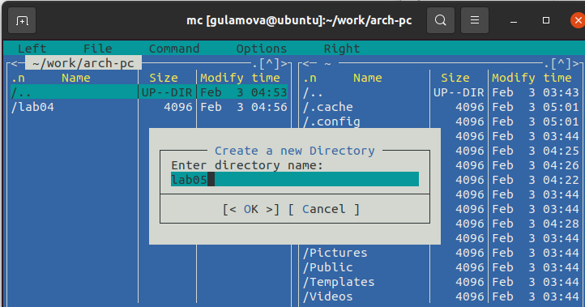
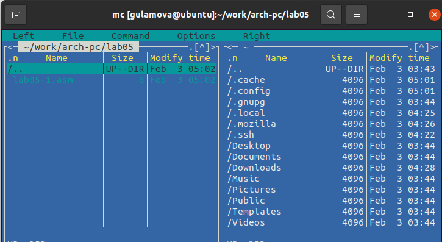
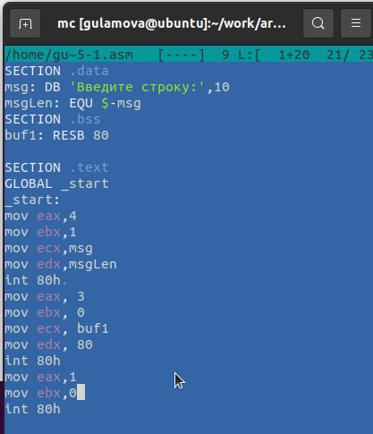
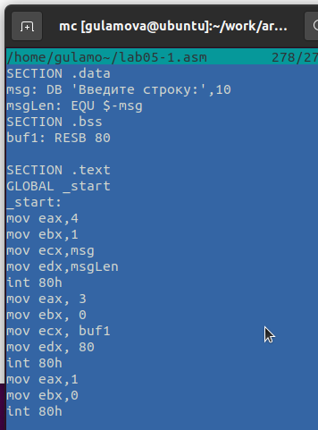
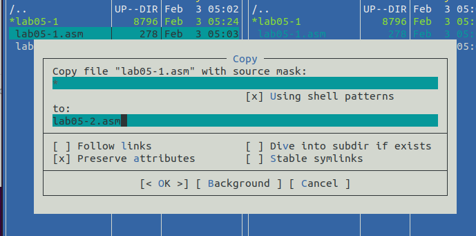
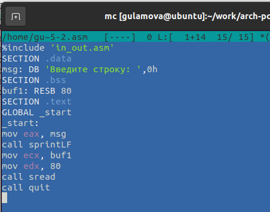
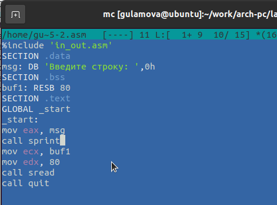
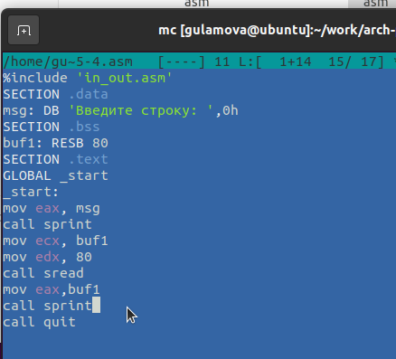

---
## Front matter
title: "Отчёт по лабораторной работе 5"
subtitle: "Архитектура компьютера"
author: "Гуламова Е.М. НПИбд-03-23"

## Generic otions
lang: ru-RU
toc-title: "Содержание"

## Bibliography
bibliography: bib/cite.bib
csl: pandoc/csl/gost-r-7-0-5-2008-numeric.csl

## Pdf output format
toc: true # Table of contents
toc-depth: 2
lof: true # List of figures
lot: true # List of tables
fontsize: 12pt
linestretch: 1.5
papersize: a4
documentclass: scrreprt
## I18n polyglossia
polyglossia-lang:
  name: russian
  options:
	- spelling=modern
	- babelshorthands=true
polyglossia-otherlangs:
  name: english
## I18n babel
babel-lang: russian
babel-otherlangs: english
## Fonts
mainfont: PT Serif
romanfont: PT Serif
sansfont: PT Sans
monofont: PT Mono
mainfontoptions: Ligatures=TeX
romanfontoptions: Ligatures=TeX
sansfontoptions: Ligatures=TeX,Scale=MatchLowercase
monofontoptions: Scale=MatchLowercase,Scale=0.9
## Biblatex
biblatex: true
biblio-style: "gost-numeric"
biblatexoptions:
  - parentracker=true
  - backend=biber
  - hyperref=auto
  - language=auto
  - autolang=other*
  - citestyle=gost-numeric
## Pandoc-crossref LaTeX customization
figureTitle: "Рис."
tableTitle: "Таблица"
listingTitle: "Листинг"
lofTitle: "Список иллюстраций"
lotTitle: "Список таблиц"
lolTitle: "Листинги"
## Misc options
indent: true
header-includes:
  - \usepackage{indentfirst}
  - \usepackage{float} # keep figures where there are in the text
  - \floatplacement{figure}{H} # keep figures where there are in the text
---

# Цель работы

Целью работы является приобретение практических навыков работы в Midnight Commander. 
Освоение инструкций языка ассемблера mov и int.

# Выполнение лабораторной работы

1. Я запустила Midnight Commander.

2. Перешла в папку ~/work/arch-pc.

3. Создала папку lab05.

{ #fig:001 width=70%, height=70% }

4. Сделала файл lab05-1.asm.

{ #fig:002 width=70%, height=70% }

5. Открыла этот файл для редактирования.

6. Написала код программы по заданию.

{ #fig:003 width=70%, height=70% }

7. Открыла файл, чтобы проверить, и увидела, что в нем есть мой код.

{ #fig:004 width=70%, height=70% }

8. Скомпилировала программу, получила исполняемый файл и проверила его работу.

{ #fig:005 width=70%, height=70% }

9. Загрузила файл in_out.asm.

10. Добавила файл in_out.asm в мою рабочую папку.

11. Сделала копию файла lab05-1.asm и назвала её lab05-2.asm.

{ #fig:006 width=70%, height=70% }

12. Написала программу в файле lab05-2.asm, скомпилировала его и убедилась, что программа работает.

{ #fig:007 width=70%, height=70% }

{ #fig:008 width=70%, height=70% }

13. В файле lab05-2.asm поменяла подпрограмму sprintLF на sprint, пересобрала исполняемый файл, и теперь после вывода строки не происходит переход на новую строку.

{ #fig:009 width=70%, height=70% }

{ #fig:010 width=70%, height=70% }

14. Скопировала файл lab05-1.asm и изменила код так, чтобы программа запрашивала ввести строку с помощью сообщения "Введите строку:", затем читала строку с клавиатуры и выводила её обратно на экран.

{ #fig:011 width=70%, height=70% }

{ #fig:012 width=70%, height=70% }

15. Скопировала файл lab05-2.asm и адаптировала код таким же образом, чтобы он запрашивал ввод строки и выводил её на экран.

{ #fig:013 width=70%, height=70% }

{ #fig:014 width=70%, height=70% }

Разница между этими двумя способами заключается в том, что файл in_out.asm уже содержит готовые подпрограммы для ввода и вывода данных, поэтому мне просто нужно было разместить данные в соответствующих регистрах и вызвать нужную подпрограмму с помощью инструкции call.

# Выводы

Научились писать базовые ассемблерные программы. Освоили ассемблерные инструкции mov и int.