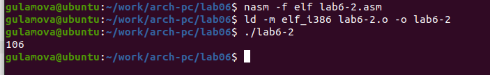
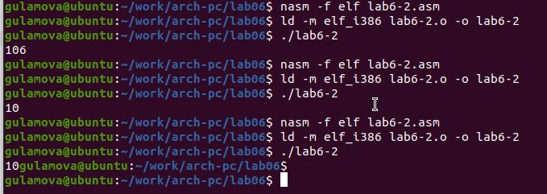

---
## Front matter
title: "Отчёт по лабораторной работе 6"
subtitle: "Архитектура компьютера"
author: "Гуламова Е.М. НПИбд-03-23"

## Generic otions
lang: ru-RU
toc-title: "Содержание"

## Bibliography
bibliography: bib/cite.bib
csl: pandoc/csl/gost-r-7-0-5-2008-numeric.csl

## Pdf output format
toc: true # Table of contents
toc-depth: 2
lof: true # List of figures
lot: true # List of tables
fontsize: 12pt
linestretch: 1.5
papersize: a4
documentclass: scrreprt
## I18n polyglossia
polyglossia-lang:
  name: russian
  options:
	- spelling=modern
	- babelshorthands=true
polyglossia-otherlangs:
  name: english
## I18n babel
babel-lang: russian
babel-otherlangs: english
## Fonts
mainfont: PT Serif
romanfont: PT Serif
sansfont: PT Sans
monofont: PT Mono
mainfontoptions: Ligatures=TeX
romanfontoptions: Ligatures=TeX
sansfontoptions: Ligatures=TeX,Scale=MatchLowercase
monofontoptions: Scale=MatchLowercase,Scale=0.9
## Biblatex
biblatex: true
biblio-style: "gost-numeric"
biblatexoptions:
  - parentracker=true
  - backend=biber
  - hyperref=auto
  - language=auto
  - autolang=other*
  - citestyle=gost-numeric
## Pandoc-crossref LaTeX customization
figureTitle: "Рис."
tableTitle: "Таблица"
listingTitle: "Листинг"
lofTitle: "Список иллюстраций"
lotTitle: "Список таблиц"
lolTitle: "Листинги"
## Misc options
indent: true
header-includes:
  - \usepackage{indentfirst}
  - \usepackage{float} # keep figures where there are in the text
  - \floatplacement{figure}{H} # keep figures where there are in the text
---

# Цель работы

Целью работы является освоение арифметических инструкций языка ассемблера NASM.

# Выполнение лабораторной работы

1. Я создала папку для программ лабораторной работы номер шесть, затем перешла в неё и 
сформировала файл с именем lab6-1.asm.

2. Давайте рассмотрим примеры программ, которые отображают символы и числовые данные. 
Эти программы будут выводить информацию, которая была помещена в регистр eax.

В одной из программ в регистр eax мы помещаем символ '6' (mov eax, '6'), а в регистр 
ebx символ '4' (mov ebx, '4'). После этого мы складываем значения, хранящиеся в регистрах 
eax и ebx (add eax, ebx, и результат сложения сохранится в eax). Затем мы выводим полученный 
результат на экран. Однако, поскольку функция sprintLF требует, чтобы в регистре eax находился 
адрес, нам нужно воспользоваться дополнительной переменной. Сначала мы переносим значение из 
регистра eax в переменную buf1 (mov [buf1],eax), а потом записываем адрес переменной buf1 
обратно в регистр eax (mov eax, buf1) и вызываем функцию sprintLF.

{ #fig:001 width=70%, height=70% }

{ #fig:002 width=70%, height=70% }

Когда я смотрю на значение в регистре eax, я ожидаю увидеть цифру 10. Но вместо этого там 
отображается символ 'j'. Это происходит из-за того, что двоичный код символа '6' равен 00110110, 
что соответствует числу 54, а двоичный код символа '4' – 00110100, или 52. Когда я использую 
команду add eax, ebx, то в регистр eax записывается их сумма – 01101010, что в десятичной системе 
равно 106, и это код для символа 'j'.

3. Затем я внесла изменения в программу, чтобы в регистры записывались числа, а не символы.

{ #fig:003 width=70%, height=70% }

{ #fig:004 width=70%, height=70% }

Но даже после этих изменений, когда программа выполняется, она не показывает число 10. 
В этот раз выводится символ с кодом 10, который является символом конца строки. В консоли он не 
виден, но создает пустую строку.

4. Как я уже упоминала, для работы с числами в файле in_out.asm были реализованы специальные 
подпрограммы, которые позволяют преобразовывать ASCII символы в числа и наоборот. 
Я использовала эти функции, чтобы изменить текст программы.

{ #fig:005 width=70%, height=70% }

{ #fig:006 width=70%, height=70% }

Когда я запустила программу, она выдала мне число 106. Так же, как в первом случае, 
здесь функция add суммирует коды символов '6' и '4', что в сумме даёт 54+52=106. 
Но в отличие от предыдущей программы, здесь используется функция iprintLF, которая позволяет 
выводить число, а не символ, соответствующий этому числовому коду.

5. Подобно предыдущему примеру, я заменила символы на числа.

{ #fig:007 width=70%, height=70% }

Благодаря функции iprintLF, которая выводит числа, и тому, что в качестве операндов были 
использованы именно числа, а не коды символов, в результате получилось число 10.

{ #fig:008 width=70%, height=70% }

Я изменила функцию iprintLF на iprint, собрала исполняемый файл и запустила его. 
Отличие заключалось в том, что теперь вывод не сопровождался переносом строки.

{ #fig:009 width=70%, height=70% }

6. В качестве примера, демонстрирующего выполнение арифметических операций в NASM, я написала 
программу для вычисления арифметического выражения $$f(x) = (5 * 2 + 3)/3$$.

{ #fig:010 width=70%, height=70% }

{ #fig:011 width=70%, height=70% }

Затем я изменила код программы, чтобы она вычисляла выражение $$f(x) = (4 * 6 + 2)/5$$. 
После создания исполняемого файла я проверила, как он работает.

{ #fig:012 width=70%, height=70% }

{ #fig:013 width=70%, height=70% }

7. Давайте возьмем для примера задачу, где нужно вычислить вариант упражнения на основе номера 
студенческого билета. Здесь нам придется работать с числом, которое мы введем через клавиатуру. 
Как я уже упоминала ранее, вводимые данные поступают в виде символов, и чтобы выполнять с ними 
математические операции в NASM, их нужно преобразовать в числовой формат. В этом может помочь 
функция atoi, которую можно найти в файле in_out.asm.

{ #fig:014 width=70%, height=70% }

{ #fig:015 width=70%, height=70% }

ответы на вопросы

1. Какие строки листинга отвечают за вывод на экран сообщения ‘Ваш вариант:’?

- Команда mov eax, rem загружает в регистр значение, соответствующее строке "Ваш вариант:".

- Использование call sprint приводит к выполнению функции, отображающей строку.

2. Для чего используется следующие инструкции?

```
mov ecx, x 
mov edx, 80 
call sread
```
  
Они используются для ввода номера студенческого билета и его сохранения в переменной X через терминал.

3. Для чего используется инструкция “call atoi”?

Данная функция преобразует введённые пользователем символы в числовое значение.

4. Какие строки листинга отвечают за вычисления варианта?

```
xor edx,edx
mov ebx,20
div ebx
inc edx
```

Эти команды выполняют операцию деления номера студенческого билета на 20 и увеличивают остаток от деления на единицу.

5. В какой регистр записывается остаток от деления при выполнении инструкции “div ebx”?

Остаток от деления помещается в регистр edx.

6. Для чего используется инструкция “inc edx”?

Эта команда увеличивает значение в регистре edx на единицу, что необходимо для расчёта номера варианта по заданной формуле.

7. Какие строки листинга отвечают за вывод на экран результата вычислений? 

- mov eax, edx – перемещает результат вычислений в регистр eax.

- call iprintLF – инициирует функцию, которая выводит результат на экран с переводом строки.

8. Написать программу вычисления выражения y = f(x). Программа должна выводить выражение 
для вычисления, выводить запрос на ввод значения x, 
вычислять заданное выражение в зависимости от введенного x, выводить результат вычислений. 
Вид функции f(x) выбрать из таблицы 6.3 вариантов заданий в соответствии с номером 
полученным при выполнении лабораторной работы. 
Создайте исполняемый файл и проверьте его работу для значений x1 и x2 из 6.3.

Получили вариант 10 - $$5(x+18)-28$$  для $$x_{1}=2, x_{2}=3$$

{ #fig:016 width=70%, height=70% }

{ #fig:017 width=70%, height=70% }

# Выводы

Изучили работу с арифметическими операциями.