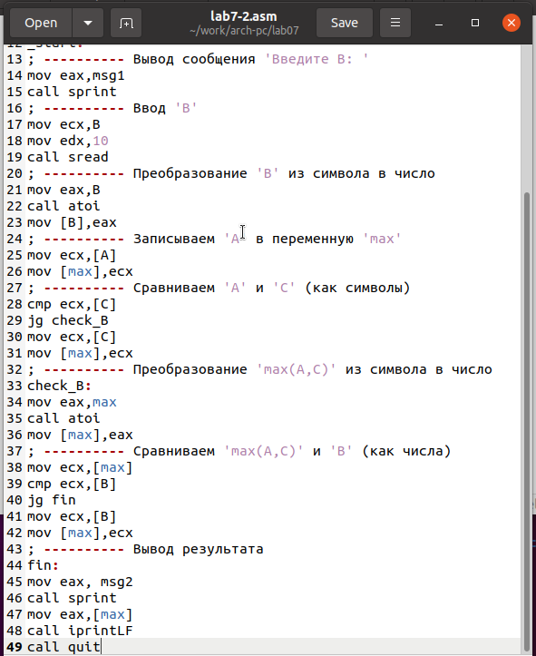

---
## Front matter
title: "Отчёт по лабораторной работе 7"
subtitle: "Архитектура компьютера"
author: "Гуламова Е.М. НПИбд-03-23"

## Generic otions
lang: ru-RU
toc-title: "Содержание"

## Bibliography
bibliography: bib/cite.bib
csl: pandoc/csl/gost-r-7-0-5-2008-numeric.csl

## Pdf output format
toc: true # Table of contents
toc-depth: 2
lof: true # List of figures
lot: true # List of tables
fontsize: 12pt
linestretch: 1.5
papersize: a4
documentclass: scrreprt
## I18n polyglossia
polyglossia-lang:
  name: russian
  options:
	- spelling=modern
	- babelshorthands=true
polyglossia-otherlangs:
  name: english
## I18n babel
babel-lang: russian
babel-otherlangs: english
## Fonts
mainfont: PT Serif
romanfont: PT Serif
sansfont: PT Sans
monofont: PT Mono
mainfontoptions: Ligatures=TeX
romanfontoptions: Ligatures=TeX
sansfontoptions: Ligatures=TeX,Scale=MatchLowercase
monofontoptions: Scale=MatchLowercase,Scale=0.9
## Biblatex
biblatex: true
biblio-style: "gost-numeric"
biblatexoptions:
  - parentracker=true
  - backend=biber
  - hyperref=auto
  - language=auto
  - autolang=other*
  - citestyle=gost-numeric
## Pandoc-crossref LaTeX customization
figureTitle: "Рис."
tableTitle: "Таблица"
listingTitle: "Листинг"
lofTitle: "Список иллюстраций"
lotTitle: "Список таблиц"
lolTitle: "Листинги"
## Misc options
indent: true
header-includes:
  - \usepackage{indentfirst}
  - \usepackage{float} # keep figures where there are in the text
  - \floatplacement{figure}{H} # keep figures where there are in the text
---

# Цель работы

Целью работы является изучение команд условного и безусловного переходов. 
Приобретение навыков написания программ с использованием переходов. 
Знакомство с назначением и структурой файла листинга.

# Выполнение лабораторной работы

1. Я создала папку для программы, которую буду использовать в лабораторной работе номер семь, 
и подготовила файл lab7-1.asm для написания кода.

2. В NASM команда jmp позволяет выполнять безусловные переходы. Давайте посмотрим на пример 
программы, где эта команда применяется.

Я ввела текст программы в файл lab7-1.asm, следуя примеру из листинга 7.1.

{ #fig:001 width=70%, height=70% }

Затем я скомпилировала эту программу, создав исполняемый файл, и успешно запустила его.

{ #fig:002 width=70%, height=70% }

Команда jmp не ограничивается только прямыми переходами; она также позволяет переходить назад. 
Я изменила программу так, чтобы она сначала выводила "Сообщение № 2", затем "Сообщение № 1" 
и после этого завершала свою работу. Для этого я добавила в код программы после вывода 
"Сообщение № 2" команду jmp с меткой _label1, которая переводит выполнение к коду, выводящему 
"Сообщение № 1". После вывода "Сообщение № 1" я вставила ещё одну команду jmp, на этот раз 
с меткой _end, чтобы перейти к завершающей части программы с вызовом функции quit.

Изменила текст программы в соответствии с листингом 7.2.

{ #fig:003 width=70%, height=70% }

{ #fig:004 width=70%, height=70% }

Изменила команды jmp для изменения порядка вывода сообщений программой.
```
Сообщение № 3
Сообщение № 2
Сообщение № 1
```

{ #fig:005 width=70%, height=70% }

{ #fig:006 width=70%, height=70% }

3. Команда jmp всегда заставляет программу перейти к указанной точке. 
Но иногда мне нужно сделать так, чтобы переход выполнялся только при определённых условиях. 
Например, я написала программу, которая сравнивает три целых числа: A, B и C, чтобы выявить 
и показать на экране самое большое из них. Я заранее задала значения для A и C, а значение 
для B программа получает от пользователя через ввод с клавиатуры.

Я собрала исполняемый файл и проверила, как он работает, вводя различные числа для B.

{ #fig:007 width=70%, height=70% }

{ #fig:008 width=70%, height=70% }

4. Обычно при работе с nasm получается только объектный файл после ассемблирования. 
Но на этот раз мне нужно было создать файл листинга, что я сделала, используя ключ -l и 
указав имя нужного файла прямо в командной строке.

Я подготовила файл листинга для своей программы, находящейся в файле lab7-2.asm, 
и внимательно изучила его структуру и содержимое. 
Подробно расскажу о трёх строках из этого файла.

{ #fig:009 width=70%, height=70% }

строка 211

* 34 - номер строки

* 0000012E - адрес

* B8[00000000] - машинный код

* mov eax,max - код программы

строка 212

* 35 - номер строки

* 00000133 - адрес

* E864FFFFFF - машинный код

* call atoi - код программы

строка 213

* 36 - номер строки

* 00000138 - адрес

* A3[00000000] - машинный код

* mov [max],eax - код программы


Затем я открыла исходный файл программы lab7-2.asm и в одной из инструкций, 
где было два операнда, удалила один из них. После этого я попыталась снова ассемблировать 
программу, чтобы получить файл листинг.

{ #fig:010 width=70%, height=70% }

{ #fig:011 width=70%, height=70% }

Из-за внесённой мной ошибки объектный файл создать не удалось, однако я всё равно получила 
файл листинга, в котором чётко было указано, где произошла ошибка.

5. Напишите программу нахождения наименьшей из 3 целочисленных переменных a,b и c. 
Значения переменных выбрать из табл. 7.5 в соответствии с вариантом, полученным при выполнении лабораторной работы № 6.
Создайте исполняемый файл и проверьте его работу

для варианта 10 - 41,62,35

{ #fig:012 width=70%, height=70% }

{ #fig:013 width=70%, height=70% }

6. Напишите программу, которая для введенных с клавиатуры значений x и a вычисляет значение заданной функции f(x) и выводит результат вычислений. 
Вид функции f(x) выбрать из таблицы 7.6 вариантов заданий в соответствии с вариантом, полученным при выполнении лабораторной работы № 7. 
Создайте исполняемый файл и проверьте его работу для значений X и a из 7.6.

для варианта 10

$$
 \begin{cases}
	x-2, x > 2
	\\   
	3a, x \le 2
 \end{cases}
$$

{ #fig:014 width=70%, height=70% }

{ #fig:015 width=70%, height=70% }

# Выводы

Изучили команды условного и безусловного переходов, познакомились с фалом листинга.