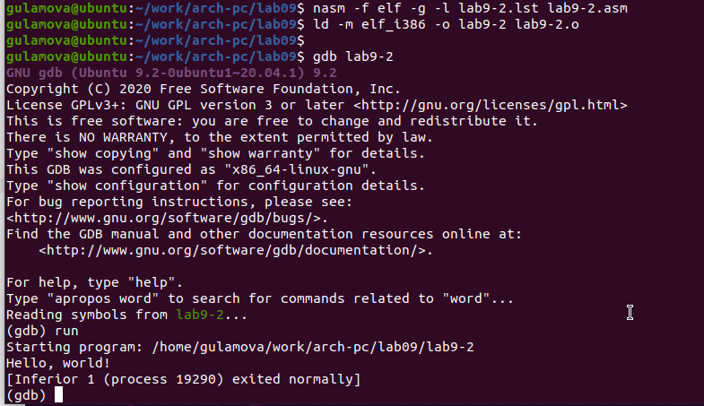

---
## Front matter
title: "Отчёт по лабораторной работе 9"
subtitle: "Архитектура компьютера"
author: "Гуламова Е.М. НПИбд-03-23"

## Generic otions
lang: ru-RU
toc-title: "Содержание"

## Bibliography
bibliography: bib/cite.bib
csl: pandoc/csl/gost-r-7-0-5-2008-numeric.csl

## Pdf output format
toc: true # Table of contents
toc-depth: 2
lof: true # List of figures
lot: true # List of tables
fontsize: 12pt
linestretch: 1.5
papersize: a4
documentclass: scrreprt
## I18n polyglossia
polyglossia-lang:
  name: russian
  options:
	- spelling=modern
	- babelshorthands=true
polyglossia-otherlangs:
  name: english
## I18n babel
babel-lang: russian
babel-otherlangs: english
## Fonts
mainfont: PT Serif
romanfont: PT Serif
sansfont: PT Sans
monofont: PT Mono
mainfontoptions: Ligatures=TeX
romanfontoptions: Ligatures=TeX
sansfontoptions: Ligatures=TeX,Scale=MatchLowercase
monofontoptions: Scale=MatchLowercase,Scale=0.9
## Biblatex
biblatex: true
biblio-style: "gost-numeric"
biblatexoptions:
  - parentracker=true
  - backend=biber
  - hyperref=auto
  - language=auto
  - autolang=other*
  - citestyle=gost-numeric
## Pandoc-crossref LaTeX customization
figureTitle: "Рис."
tableTitle: "Таблица"
listingTitle: "Листинг"
lofTitle: "Список иллюстраций"
lotTitle: "Список таблиц"
lolTitle: "Листинги"
## Misc options
indent: true
header-includes:
  - \usepackage{indentfirst}
  - \usepackage{float} # keep figures where there are in the text
  - \floatplacement{figure}{H} # keep figures where there are in the text
---

# Цель работы

Целью работы является приобретение навыков написания программ с использованием подпрограмм.
Знакомство с методами отладки при помощи GDB и его основными возможностями.

# Выполнение лабораторной работы

1. Я создала папку для выполнения лабораторной работы номер девять, затем перешла в неё 
и сформировала файл lab9-1.asm.

2. Давайте рассмотрим пример программы, которая вычисляет арифметическую функцию 
$f(x) = 2x+7$ с использованием вспомогательной подпрограммы calcul. 
В этом случае значение $x$ мы получаем через ввод с клавиатуры, а расчёт самой функции 
происходит внутри подпрограммы.

{ #fig:001 width=70%, height=70% }

{ #fig:002 width=70%, height=70% }

3. Я внесла изменения в код программы, добавив в подпрограмму calcul дополнительную подпрограмму 
subcalcul. Это позволило мне вычислить составное выражение $f(g(x))$, где $x$ также вводится 
через клавиатуру, а функции заданы как $f(x) = 2x + 7$ и $g(x) = 3x − 1$.

{ #fig:003 width=70%, height=70% }

{ #fig:004 width=70%, height=70% }

4. Я создала файл lab9-2.asm, в который вписала код программы из Листинга 9.2, 
который выводит на экран сообщение "Hello world!".

{ #fig:005 width=70%, height=70% }

После этого я получила исполняемый файл. Чтобы использовать отладчик GDB, мне нужно было 
добавить в исполняемый файл отладочную информацию. Для этого я скомпилировала программу 
с ключом ‘-g’. Затем я загрузила исполняемый файл в отладчик gdb и проверила, 
как работает программа, выполнив её в среде GDB с использованием команды run (или просто r).

{ #fig:006 width=70%, height=70% }

Чтобы более детально разобраться в программе, я поставила точку останова у 
метки _start, с которой начинается любая программа на ассемблере, и запустила её. 
Затем я взглянула на дизассемблированный код.

{ #fig:007 width=70%, height=70% }

{ #fig:008 width=70%, height=70% }

На предыдущем этапе я уже разместила брейкпоинт с именем _start и проверила это, 
используя команду info breakpoints, или просто i b. После этого я установила ещё 
одну точку останова на адрес определённой инструкции, который можно было найти в 
середине экрана, в левой колонке напротив соответствующей инструкции. 
Я выбрала адрес предпоследней инструкции (mov ebx,0x0) и поставила там брейкпоинт.

{ #fig:009 width=70%, height=70% }

Отладчик предоставляет возможность просмотра содержимого ячеек памяти и регистров, 
и при необходимости я могу вручную поменять значения регистров или переменных. 
Я выполнила пять инструкций с помощью команды stepi (или si) и наблюдала за тем, 
как меняются значения в регистрах.

{ #fig:010 width=70%, height=70% }

{ #fig:011 width=70%, height=70% }

Я проверила значение переменной msg1 по её имени и значение переменной msg2, 
обратившись к ней по адресу.

Чтобы изменить значение регистра или ячейки памяти, я использовала команду set, 
указав ей имя регистра или адрес в качестве аргумента. Я изменила первый символ в переменной msg1.

{ #fig:012 width=70%, height=70% }

Также я вывела значение регистра edx в разных форматах: в шестнадцатеричном, в двоичном и в символьном.

{ #fig:013 width=70%, height=70% }

И далее я изменила значение регистра ebx, воспользовавшись командой set.

{ #fig:014 width=70%, height=70% }

5. Я скопировала файл lab8-2.asm, который был создан в ходе выполнения 
восьмой лабораторной работы, содержащий программу для вывода аргументов 
командной строки на экран. Затем я сформировала из него исполняемый файл. 
Чтобы загрузить эту программу в отладчик gdb вместе с аргументами, 
мне понадобилось использовать ключ --args. После этого я успешно 
загрузила исполняемый файл в отладчик, не забыв указать необходимые аргументы.

Первым делом я установила точку останова до выполнения первой инструкции программы и запустила её.

Важно отметить, что адрес вершины стека находится в регистре esp, и именно по этому 
адресу расположено значение, показывающее количество аргументов командной строки, 
включая само имя программы. В моем случае, число аргументов составило пять: имя 
программы lab9-3 и четыре аргумента - аргумент1, аргумент2 и 'аргумент 3'.

Я также исследовала другие значения в стеке: по адресу [esp+4] находится адрес в памяти, 
где расположено имя программы, по адресу [esp+8] - адрес первого аргумента, 
по адресу [esp+12] - второго, и так далее.

{ #fig:015 width=70%, height=70% }

Шаг изменения адреса в стеке составляет 4 байта ([esp+4], [esp+8], [esp+12]). 
Это связано с тем, что размер каждой переменной, хранящейся в стеке, равен четырем байтам.

6. Я модифицировала программу из восьмой лабораторной работы 
(первое задание для индивидуального выполнения), включив в нее подпрограмму для расчета 
функции f(x).

{ #fig:016 width=70%, height=70% }

{ #fig:017 width=70%, height=70% }

7. В листинге приведена программа вычисления выражения $(3+2)*4+5$.
При запуске данная программа дает неверный результат. Проверил это.
С помощью отладчика GDB, анализируя изменения значений регистров,
определю ошибку и исправлю ее.

{ #fig:018 width=70%, height=70% }

{ #fig:019 width=70%, height=70% }

Я обнаружила, что в инструкции add были перепутаны местами аргументы, и после 
завершения работы значение регистра ebx ошибочно передавалось в edi вместо ожидаемого eax. 
Эту ошибку мне предстоит исправить.

{ #fig:020 width=70%, height=70% }

{ #fig:021 width=70%, height=70% }

# Выводы

Освоили работy с подпрограммами и отладчиком.