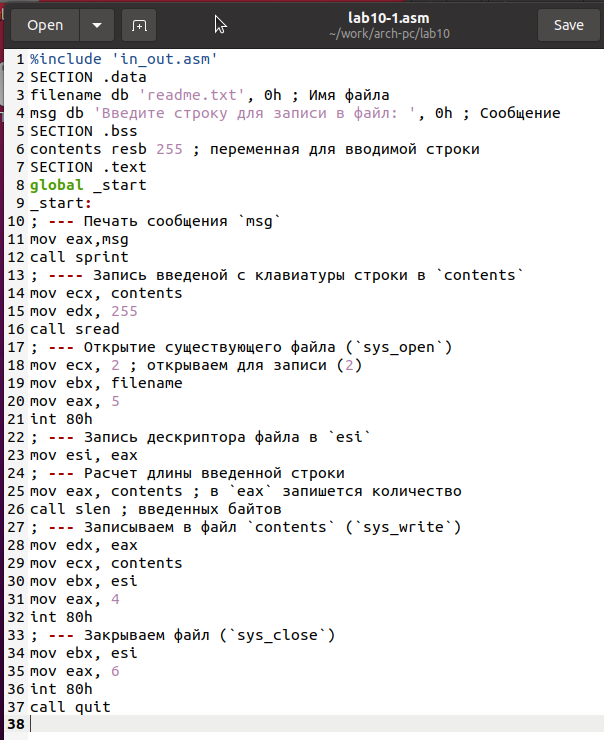
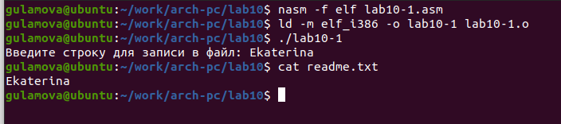
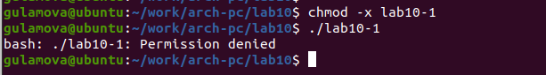
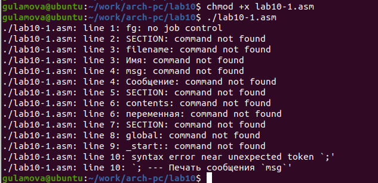
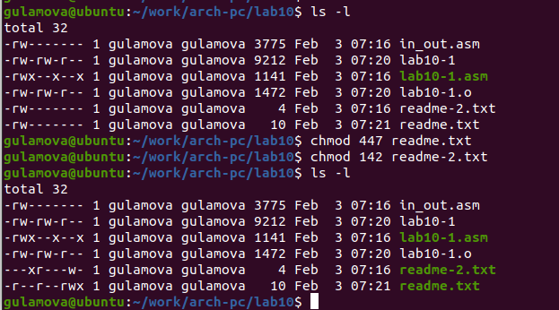
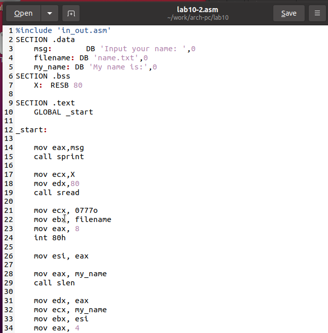
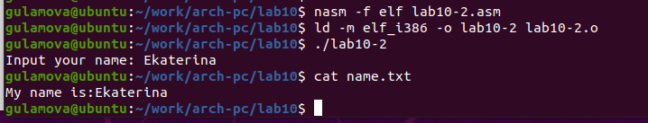

---
## Front matter
title: "Отчёт по лабораторной работе 10"
subtitle: "Архитектура компьютера"
author: "Гуламова Е.М. НПИбд-03-23"

## Generic otions
lang: ru-RU
toc-title: "Содержание"

## Bibliography
bibliography: bib/cite.bib
csl: pandoc/csl/gost-r-7-0-5-2008-numeric.csl

## Pdf output format
toc: true # Table of contents
toc-depth: 2
lof: true # List of figures
lot: true # List of tables
fontsize: 12pt
linestretch: 1.5
papersize: a4
documentclass: scrreprt
## I18n polyglossia
polyglossia-lang:
  name: russian
  options:
	- spelling=modern
	- babelshorthands=true
polyglossia-otherlangs:
  name: english
## I18n babel
babel-lang: russian
babel-otherlangs: english
## Fonts
mainfont: PT Serif
romanfont: PT Serif
sansfont: PT Sans
monofont: PT Mono
mainfontoptions: Ligatures=TeX
romanfontoptions: Ligatures=TeX
sansfontoptions: Ligatures=TeX,Scale=MatchLowercase
monofontoptions: Scale=MatchLowercase,Scale=0.9
## Biblatex
biblatex: true
biblio-style: "gost-numeric"
biblatexoptions:
  - parentracker=true
  - backend=biber
  - hyperref=auto
  - language=auto
  - autolang=other*
  - citestyle=gost-numeric
## Pandoc-crossref LaTeX customization
figureTitle: "Рис."
tableTitle: "Таблица"
listingTitle: "Листинг"
lofTitle: "Список иллюстраций"
lotTitle: "Список таблиц"
lolTitle: "Листинги"
## Misc options
indent: true
header-includes:
  - \usepackage{indentfirst}
  - \usepackage{float} # keep figures where there are in the text
  - \floatplacement{figure}{H} # keep figures where there are in the text
---

# Цель работы

Целью работы является приобретение навыков написания программ для работы с файлами.

# Выполнение лабораторной работы

1. Я создала папку для хранения файлов лабораторной работы номер десять, 
затем перешла в неё и сформировала три файла: lab10-1.asm, readme-1.txt и readme-2.txt.

2. В файл lab10-1.asm я внесла код программы, который был приведен в листинге 10.1, 
относящемся к программе записи сообщений в файл. После этого я скомпилировала 
его в исполняемый файл и убедилась в его корректной работе.

{ #fig:001 width=70%, height=70% }

{ #fig:002 width=70%, height=70% }

3. Используя команду chmod, я изменила права на файл lab10-1 так, 
чтобы запретить его выполнение, и попыталась его запустить. Ожидаемо, файл 
не запустился, так как я убрала право на выполнение, сняв атрибут 'x'.

{ #fig:003 width=70%, height=70% }

4. Снова с помощью команды chmod я изменила права на файл lab10-1.asm, 
содержащий исходный код программы, добавив право на его выполнение. Когда я попыталась его 
выполнить, терминал начал интерпретировать его содержимое как команды оболочки, но так 
как там были инструкции ассемблера, а не shell-команды, это вызвало ошибки. 

Однако, если бы в этом файле были допустимые команды оболочки, то они бы выполнились.

{ #fig:004 width=70%, height=70% }

5. Я настроила права доступа к текстовым файлам readme в соответствии с 
указаниями из таблицы 10.4. Для проверки корректности установленных прав я использовала 
команду ls -l, чтобы увидеть текущие права на файлы.

для варианта 10: ```r-- r-- rwx``` и ```001 100 010```

{ #fig:005 width=70%, height=70% }

6. Написала программу работающую по следующему алгоритму:

* Вывод приглашения “Как Вас зовут?”

* ввести с клавиатуры свои фамилию и имя

* создать файл с именем name.txt

* записать в файл сообщение “Меня зовут”

* дописать в файл строку введенную с клавиатуры

* закрыть файл

Код программы

```
%include 'in_out.asm'
SECTION .data
    msg:	DB 'Input your name: ',0
    filename: DB 'name.txt',0
    my_name: DB 'My name is:',0
SECTION .bss
    X:	RESB 80

SECTION .text
    GLOBAL _start

_start:

    mov eax,msg
    call sprint

    mov ecx,X
    mov edx,80
    call sread

    mov ecx, 0777o
    mov ebx, filename
    mov eax, 8
    int 80h
 
    mov esi, eax 

    mov eax, my_name
    call slen 

    mov edx, eax 
    mov ecx, my_name
    mov ebx, esi 
    mov eax, 4
    int 80h 

    mov ebx, esi 
    mov eax, 6 
    int 80h

    mov ecx,1 
    mov ebx, filename 
    mov eax, 5
    int 80h 

    mov esi, eax  
   
    mov edx, 2 
    mov ecx,0
    mov ebx, eax 
    mov eax, 19 
    int 80h 
    

    mov eax, X
    call slen 
   
    mov edx,eax 
    mov ecx, X 
    mov ebx, esi 
    mov eax, 4
    int 80h

    mov ebx, esi 
    mov eax, 6 
    int 80h 
    
    call quit
```

{ #fig:006 width=70%, height=70% }

{ #fig:007 width=70%, height=70% }

# Выводы

Освоили работy с файлами и правами доступа.